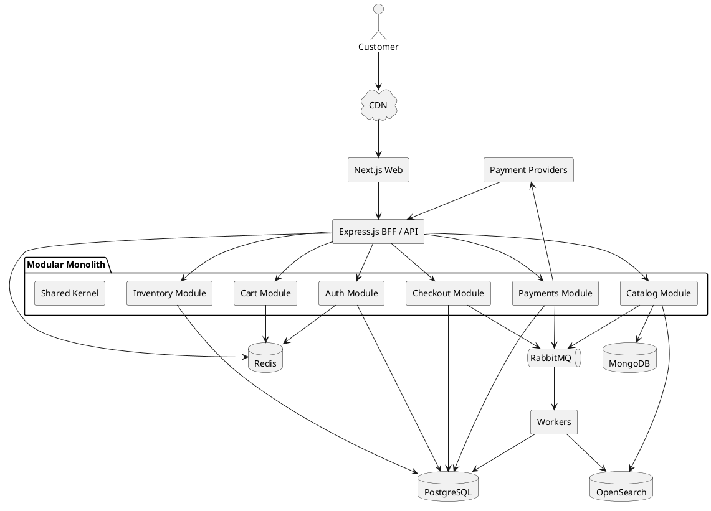

# Production-Grade E-Commerce Platform Architecture

## 1. Architecture Overview

### 1.1 Scope and assumptions

- Initial deployment is single-region.
- CDN is enabled globally for static assets, cached HTML, and image delivery.
- Business model is single-vendor with multi-warehouse inventory.
- Catalog is large, changes frequently, and must support dynamic attributes and faceted search.
- Checkout and inventory require strict correctness. No overselling is permitted.
- Payments must support synchronous redirects and asynchronous webhook confirmation.
- Target scale is `100K-1M DAU` with `10-20x` flash-sale spikes and `10K+` concurrent checkout attempts.

### 1.2 Architectural decisions

- Backend architecture: `Modular Monolith` with `Hexagonal Architecture`.
- Runtime: `Node.js 20 + TypeScript`.
- HTTP framework: `Express.js`.
- ORM: `Prisma` for standard persistence and schema migrations.
- Transactional database: `PostgreSQL 16`.
- Catalog authoring store: `MongoDB`.
- Search index: `OpenSearch`.
- Cache and ephemeral state: `Redis`.
- Async messaging: `RabbitMQ`.
- Frontend: `Next.js App Router` with `SSR`, `ISR`, `edge caching`, and `streaming`.
- Deployment: `Docker + Kubernetes`.

### 1.3 Why this architecture is correct

- A modular monolith keeps the critical transactional boundary local to PostgreSQL, which is necessary for inventory and order correctness.
- Hexagonal boundaries prevent framework leakage and preserve extractable modules.
- PostgreSQL owns all correctness-critical state. No critical write path depends on MongoDB, Redis, or OpenSearch.
- MongoDB is limited to catalog authoring and flexible product metadata, where schema variability is useful.
- OpenSearch is a derived read model only. Search can degrade without corrupting orders or inventory.
- RabbitMQ is used for asynchronous integrations and secondary projections, not for core inventory correctness.

### 1.4 Service and module boundaries

The backend runs as one deployable application initially, but the codebase is partitioned into hard modules:

- `catalog`: product authoring, product publication, search projection triggers
- `inventory`: stock ledger, availability, reservations, warehouse allocation
- `checkout`: cart validation, order creation, saga orchestration, payment coordination
- `payments`: provider adapters, webhook verification, settlement state transitions
- `auth`: users, sessions, refresh tokens, RBAC
- `cart`: Redis-backed ephemeral carts
- `shared`: logging, idempotency, outbox, configuration, error model

Cross-module access is only through explicit application ports. Direct repository access across modules is forbidden.

## 2. System Diagram

### 2.1 Component diagram



### 2.2 Request and data flow

1. Product pages are rendered in `Next.js` using cached search/catalog read models.
2. Catalog write operations update `MongoDB`.
3. Catalog publication emits domain events through an `outbox` in PostgreSQL and pushes to `RabbitMQ`.
4. Workers project catalog changes into `OpenSearch` and invalidate Redis/CDN caches.
5. Checkout reads cart state from `Redis`, validates prices and availability against authoritative services, then creates the order and reservation in PostgreSQL.
6. Payment initiation happens after order creation and inventory reservation.
7. Payment provider webhooks update payment state, which drives saga completion or compensation.

## 3. Backend Design

### 3.1 Monorepo layout

```text
repo/
  apps/
    api/
      src/
        bootstrap/
        modules/
          auth/
            domain/
            application/
            infrastructure/
            interfaces/
          cart/
          catalog/
          checkout/
          inventory/
          payments/
        shared/
    web/
      app/
      components/
      features/
      lib/
  packages/
    config/
    types/
  infra/
    docker/
    k8s/
    github-actions/
  docs/
```

### 3.2 Internal module contract

Each module follows the same structure:

- `domain`: entities, value objects, aggregates, domain services, domain events
- `application`: use cases, command handlers, query handlers, ports, policies
- `infrastructure`: Prisma repositories, Mongo adapters, Redis adapters, RabbitMQ publishers, payment provider clients
- `interfaces`: REST routes, GraphQL resolvers, DTOs, validators

Rules:

- Domain code contains no Prisma, Express, Redis, or HTTP types.
- Application layer talks only to ports.
- Infrastructure implements ports and is wired during bootstrap.
- Inter-module calls use exported application services, never raw repositories.

### 3.3 Backend runtime choices

- `Express.js` is selected because the team wants the broadest middleware ecosystem, lower hiring friction, and explicit control over framework structure while still keeping the domain isolated behind hexagonal boundaries.
- `Prisma` is used for normal persistence, migrations, and type-safe access.
- Inventory reservation and other contention-heavy operations use explicit SQL through `prisma.$queryRaw` inside transactions. That path is too critical to hide behind ORM abstractions.
- `Zod` validates every external payload at the interface boundary.
- `Pino` is the logging backend with request correlation IDs propagated into OpenTelemetry traces.

### 3.4 Key domain aggregates

- `Product`: authoring aggregate in catalog, versioned on publish
- `InventoryItem`: per `sku + warehouse` aggregate with `onHand`, `reserved`, `version`
- `InventoryReservation`: reservation aggregate with TTL and state transitions
- `Order`: checkout aggregate with explicit state machine
- `PaymentAttempt`: provider interaction state, idempotent against provider references
- `UserSession`: refresh-token rotation and revocation state

### 3.5 Order state machine

Valid order states:

- `PENDING`
- `AWAITING_PAYMENT`
- `CONFIRMED`
- `PAYMENT_FAILED`
- `CANCELLED`
- `EXPIRED`

Invalid direct transitions are rejected at the domain layer.

## 4. Database Schema

### 4.1 PostgreSQL schema

Transactional state lives in PostgreSQL. Inventory and order correctness never depend on MongoDB, Redis, or OpenSearch.

```sql
CREATE TABLE users (
  id UUID PRIMARY KEY,
  email CITEXT NOT NULL UNIQUE,
  password_hash TEXT NOT NULL,
  status TEXT NOT NULL CHECK (status IN ('ACTIVE', 'DISABLED', 'LOCKED')),
  created_at TIMESTAMPTZ NOT NULL DEFAULT now(),
  updated_at TIMESTAMPTZ NOT NULL DEFAULT now()
);

CREATE TABLE roles (
  id UUID PRIMARY KEY,
  name TEXT NOT NULL UNIQUE
);

CREATE TABLE permissions (
  id UUID PRIMARY KEY,
  name TEXT NOT NULL UNIQUE
);

CREATE TABLE user_roles (
  user_id UUID NOT NULL REFERENCES users(id) ON DELETE CASCADE,
  role_id UUID NOT NULL REFERENCES roles(id) ON DELETE CASCADE,
  PRIMARY KEY (user_id, role_id)
);

CREATE TABLE role_permissions (
  role_id UUID NOT NULL REFERENCES roles(id) ON DELETE CASCADE,
  permission_id UUID NOT NULL REFERENCES permissions(id) ON DELETE CASCADE,
  PRIMARY KEY (role_id, permission_id)
);

CREATE TABLE refresh_tokens (
  id UUID PRIMARY KEY,
  user_id UUID NOT NULL REFERENCES users(id) ON DELETE CASCADE,
  token_hash TEXT NOT NULL UNIQUE,
  family_id UUID NOT NULL,
  issued_at TIMESTAMPTZ NOT NULL,
  expires_at TIMESTAMPTZ NOT NULL,
  revoked_at TIMESTAMPTZ,
  replaced_by_token_id UUID,
  user_agent TEXT,
  ip_address INET
);

CREATE TABLE inventory_items (
  id UUID PRIMARY KEY,
  sku TEXT NOT NULL,
  warehouse_id UUID NOT NULL,
  on_hand_qty INTEGER NOT NULL CHECK (on_hand_qty >= 0),
  reserved_qty INTEGER NOT NULL CHECK (reserved_qty >= 0),
  version INTEGER NOT NULL DEFAULT 0,
  updated_at TIMESTAMPTZ NOT NULL DEFAULT now(),
  UNIQUE (sku, warehouse_id),
  CHECK (reserved_qty <= on_hand_qty)
);

CREATE TABLE inventory_reservations (
  id UUID PRIMARY KEY,
  order_id UUID NOT NULL,
  sku TEXT NOT NULL,
  warehouse_id UUID NOT NULL,
  quantity INTEGER NOT NULL CHECK (quantity > 0),
  status TEXT NOT NULL CHECK (status IN ('PENDING', 'CONFIRMED', 'RELEASED', 'EXPIRED')),
  expires_at TIMESTAMPTZ NOT NULL,
  created_at TIMESTAMPTZ NOT NULL DEFAULT now(),
  updated_at TIMESTAMPTZ NOT NULL DEFAULT now(),
  UNIQUE (order_id, sku, warehouse_id)
);

CREATE TABLE orders (
  id UUID PRIMARY KEY,
  customer_id UUID NOT NULL REFERENCES users(id),
  order_number BIGSERIAL UNIQUE,
  currency CHAR(3) NOT NULL,
  subtotal_amount BIGINT NOT NULL,
  discount_amount BIGINT NOT NULL DEFAULT 0,
  shipping_amount BIGINT NOT NULL DEFAULT 0,
  tax_amount BIGINT NOT NULL DEFAULT 0,
  total_amount BIGINT NOT NULL,
  status TEXT NOT NULL CHECK (status IN (
    'PENDING',
    'AWAITING_PAYMENT',
    'CONFIRMED',
    'PAYMENT_FAILED',
    'CANCELLED',
    'EXPIRED'
  )),
  idempotency_key UUID NOT NULL,
  created_at TIMESTAMPTZ NOT NULL DEFAULT now(),
  updated_at TIMESTAMPTZ NOT NULL DEFAULT now(),
  UNIQUE (customer_id, idempotency_key)
);

CREATE TABLE order_items (
  id UUID PRIMARY KEY,
  order_id UUID NOT NULL REFERENCES orders(id) ON DELETE CASCADE,
  sku TEXT NOT NULL,
  product_snapshot JSONB NOT NULL,
  unit_price_amount BIGINT NOT NULL,
  quantity INTEGER NOT NULL CHECK (quantity > 0),
  line_total_amount BIGINT NOT NULL
);

CREATE TABLE payment_attempts (
  id UUID PRIMARY KEY,
  order_id UUID NOT NULL REFERENCES orders(id) ON DELETE CASCADE,
  provider TEXT NOT NULL,
  provider_payment_id TEXT,
  amount BIGINT NOT NULL,
  currency CHAR(3) NOT NULL,
  status TEXT NOT NULL CHECK (status IN (
    'INITIATED',
    'PENDING',
    'AUTHORIZED',
    'CAPTURED',
    'FAILED',
    'CANCELLED'
  )),
  idempotency_key UUID NOT NULL,
  provider_response JSONB,
  created_at TIMESTAMPTZ NOT NULL DEFAULT now(),
  updated_at TIMESTAMPTZ NOT NULL DEFAULT now(),
  UNIQUE (provider, idempotency_key),
  UNIQUE (provider, provider_payment_id)
);

CREATE TABLE outbox_events (
  id UUID PRIMARY KEY,
  aggregate_type TEXT NOT NULL,
  aggregate_id TEXT NOT NULL,
  event_type TEXT NOT NULL,
  payload JSONB NOT NULL,
  status TEXT NOT NULL CHECK (status IN ('PENDING', 'PUBLISHED', 'FAILED')),
  retry_count INTEGER NOT NULL DEFAULT 0,
  created_at TIMESTAMPTZ NOT NULL DEFAULT now(),
  published_at TIMESTAMPTZ
);

CREATE TABLE idempotency_records (
  id UUID PRIMARY KEY,
  scope TEXT NOT NULL,
  key TEXT NOT NULL,
  request_hash TEXT NOT NULL,
  response_code INTEGER,
  response_body JSONB,
  created_at TIMESTAMPTZ NOT NULL DEFAULT now(),
  expires_at TIMESTAMPTZ NOT NULL,
  UNIQUE (scope, key)
);
```

### 4.2 PostgreSQL indexing strategy

```sql
CREATE INDEX idx_inventory_items_sku ON inventory_items (sku);
CREATE INDEX idx_inventory_items_warehouse ON inventory_items (warehouse_id);
CREATE INDEX idx_inventory_reservations_expiry ON inventory_reservations (expires_at)
  WHERE status = 'PENDING';
CREATE INDEX idx_inventory_reservations_order ON inventory_reservations (order_id);
CREATE INDEX idx_orders_customer_created ON orders (customer_id, created_at DESC);
CREATE INDEX idx_orders_status_created ON orders (status, created_at DESC);
CREATE INDEX idx_payment_attempts_order ON payment_attempts (order_id, created_at DESC);
CREATE INDEX idx_outbox_pending ON outbox_events (status, created_at)
  WHERE status = 'PENDING';
CREATE INDEX idx_idempotency_scope_expiry ON idempotency_records (scope, expires_at);
```

### 4.3 MongoDB catalog schema

MongoDB stores authoring-time product documents. Published search and PDP payloads are projected to OpenSearch and cached.

```json
{
  "_id": "prod_01J...",
  "slug": "nike-air-zoom-pegasus-41",
  "status": "PUBLISHED",
  "brand": {
    "id": "brand_nike",
    "name": "Nike"
  },
  "title": "Air Zoom Pegasus 41",
  "description": {
    "short": "Neutral running shoe",
    "long": "..."
  },
  "categories": [
    { "id": "running", "name": "Running" },
    { "id": "mens-shoes", "name": "Men's Shoes" }
  ],
  "media": [
    {
      "type": "image",
      "url": "https://cdn.example.com/p/pegasus/front.jpg",
      "alt": "Front view"
    }
  ],
  "attributes": {
    "gender": "men",
    "material": "mesh",
    "season": "summer"
  },
  "variants": [
    {
      "sku": "PEG41-BLK-10",
      "title": "Black / 10",
      "price": { "currency": "INR", "amount": 1299900 },
      "compareAtPrice": { "currency": "INR", "amount": 1499900 },
      "attributes": { "color": "black", "size": "10" },
      "barcode": "123456789",
      "weightGrams": 320,
      "isActive": true
    }
  ],
  "seo": {
    "title": "Nike Air Zoom Pegasus 41 Running Shoes",
    "description": "Shop Nike Air Zoom Pegasus 41 with fast shipping."
  },
  "publication": {
    "version": 42,
    "publishedAt": "2026-04-24T10:00:00Z"
  },
  "updatedAt": "2026-04-24T10:00:00Z",
  "createdAt": "2026-04-01T09:00:00Z"
}
```

MongoDB indexes:

- `{ slug: 1 }` unique
- `{ status: 1, "publication.version": -1 }`
- `{ brand.id: 1, status: 1 }`
- `{ categories.id: 1, status: 1 }`
- `{ "variants.sku": 1 }` unique sparse if catalog guarantees global SKU uniqueness

### 4.4 OpenSearch document design

Search index is denormalized for query speed.

```json
{
  "productId": "prod_01J...",
  "slug": "nike-air-zoom-pegasus-41",
  "title": "Air Zoom Pegasus 41",
  "brand": "Nike",
  "categories": ["running", "mens-shoes"],
  "attributes": {
    "gender": ["men"],
    "material": ["mesh"],
    "color": ["black", "blue"],
    "size": ["8", "9", "10", "11"]
  },
  "priceMin": 1299900,
  "priceMax": 1299900,
  "currency": "INR",
  "isActive": true,
  "popularityScore": 0.0,
  "updatedAt": "2026-04-24T10:00:00Z"
}
```

OpenSearch mappings:

- `title`: `text` with keyword subfield
- `brand`, `categories`, attribute buckets: `keyword`
- `priceMin`, `priceMax`: `long`
- `updatedAt`: `date`
- `isActive`: `boolean`
- `popularityScore`: `float`

## 5. Concurrency & Consistency Strategy

### 5.1 Inventory correctness model

Inventory availability is computed as:

- `available = on_hand_qty - reserved_qty`

Rules:

- `on_hand_qty` changes only through stock adjustment workflows.
- `reserved_qty` changes only through reservation create/confirm/release flows.
- Reservation is required before payment initiation.
- Cache is never authoritative for availability.

### 5.2 Reservation algorithm

Checkout allocates stock warehouse-by-warehouse using deterministic selection:

1. Sort eligible warehouses by policy: same region, then lowest shipping cost, then highest available stock.
2. Attempt reservation in a single PostgreSQL transaction.
3. For each candidate `sku + warehouse`, perform optimistic conditional update.
4. Create matching `inventory_reservations` rows with the same transaction.
5. If total quantity cannot be reserved, roll back the transaction and fail the checkout attempt.

Critical SQL:

```sql
UPDATE inventory_items
SET reserved_qty = reserved_qty + $1,
    version = version + 1,
    updated_at = now()
WHERE sku = $2
  AND warehouse_id = $3
  AND (on_hand_qty - reserved_qty) >= $1
  AND version = $4;
```

This query is the oversell guardrail. If it affects `0` rows, the caller rereads current state and retries with bounded attempts.

### 5.3 Retry policy

- Max retries on inventory contention: `3`
- Retry backoff: `15ms`, `40ms`, `100ms` with jitter
- If all retries fail, return `409 CONFLICT` with machine-readable code `INVENTORY_CONTENTION`
- Under flash-sale pressure, fail fast instead of unbounded retries to protect database health

### 5.4 Reservation TTL

- Default reservation TTL: `15 minutes`
- Background expiration worker runs every `30 seconds`
- Expiration job updates reservation status to `EXPIRED`, decrements `reserved_qty`, and emits `inventory.reservation.expired`
- Expiration is idempotent. Re-running the same expiration has no effect once status is non-`PENDING`

Release SQL:

```sql
UPDATE inventory_items
SET reserved_qty = reserved_qty - $1,
    version = version + 1,
    updated_at = now()
WHERE sku = $2
  AND warehouse_id = $3
  AND reserved_qty >= $1;
```

### 5.5 Checkout saga

Orchestration is implemented inside the `checkout` module. The orchestrator persists every step transition in PostgreSQL.

Saga steps:

1. Validate cart and price snapshots
2. Create order in `PENDING`
3. Reserve inventory
4. Create payment attempt
5. Mark order `AWAITING_PAYMENT`
6. Receive payment confirmation webhook
7. Confirm reservation and mark order `CONFIRMED`
8. On any failure after reservation, compensate by releasing reservation and marking order terminal failure state

The order is not `CONFIRMED` until payment capture and reservation confirmation both succeed.

### 5.6 Outbox pattern

Every cross-boundary event is persisted in the same database transaction as the business change:

- `order.created`
- `inventory.reserved`
- `payment.attempted`
- `payment.captured`
- `order.confirmed`
- `inventory.released`
- `catalog.published`

RabbitMQ publishers only read from `outbox_events`. This eliminates dual-write inconsistency.

### 5.7 Idempotency design

Checkout endpoints require `Idempotency-Key`.

Rules:

- Key is scoped to `customer_id + route`.
- Request payload is hashed. Reuse of the same key with different payload returns `422`.
- Successful or failed response is stored and replayed for duplicate retries.
- TTL for idempotency records: `24 hours`.

## 6. API Contracts

### 6.1 Checkout REST API

#### `POST /api/v1/checkout`

Headers:

```http
Authorization: Bearer <access-token>
Idempotency-Key: 8c91e6ea-5a59-4ab2-8e2d-df6338a3aaf1
Content-Type: application/json
```

Request:

```json
{
  "cartId": "cart_01HT...",
  "shippingAddressId": "addr_01HT...",
  "billingAddressId": "addr_01HT...",
  "paymentMethod": {
    "type": "UPI_INTENT"
  }
}
```

Response `202 Accepted`:

```json
{
  "orderId": "ord_01J...",
  "status": "AWAITING_PAYMENT",
  "payment": {
    "attemptId": "pay_01J...",
    "provider": "razorpay",
    "redirectUrl": "https://checkout.razorpay.com/..."
  },
  "expiresAt": "2026-04-24T10:15:00Z"
}
```

Error responses:

- `409 INVENTORY_UNAVAILABLE`
- `409 INVENTORY_CONTENTION`
- `422 IDEMPOTENCY_KEY_REUSED_WITH_DIFFERENT_PAYLOAD`
- `400 CART_INVALID`

#### `POST /api/v1/payments/webhooks/razorpay`

- Signature verification is mandatory before parsing business content.
- Handler is idempotent by `provider_payment_id + event_id`.
- Webhook writes provider event row, updates payment attempt, and schedules saga continuation.

Response:

```json
{
  "accepted": true
}
```

#### `GET /api/v1/orders/:orderId`

Response:

```json
{
  "id": "ord_01J...",
  "status": "CONFIRMED",
  "currency": "INR",
  "totalAmount": 1299900,
  "items": [
    {
      "sku": "PEG41-BLK-10",
      "name": "Air Zoom Pegasus 41",
      "quantity": 1,
      "unitPriceAmount": 1299900
    }
  ],
  "paymentStatus": "CAPTURED",
  "createdAt": "2026-04-24T10:00:00Z"
}
```

### 6.2 Catalog GraphQL API

Schema excerpt:

```graphql
type Query {
  products(input: ProductSearchInput!): ProductSearchResult!
  productBySlug(slug: String!): ProductDetail
}

input ProductSearchInput {
  query: String
  categoryIds: [String!]
  priceMin: Int
  priceMax: Int
  attributes: [AttributeFilterInput!]
  sort: ProductSort!
  page: Int!
  pageSize: Int!
}

input AttributeFilterInput {
  name: String!
  values: [String!]!
}

type ProductSearchResult {
  items: [ProductCard!]!
  facets: [Facet!]!
  pagination: Pagination!
}
```

Request:

```graphql
query ProductListing {
  products(
    input: {
      query: "running shoes"
      categoryIds: ["running"]
      priceMin: 500000
      priceMax: 1500000
      attributes: [
        { name: "color", values: ["black"] }
        { name: "size", values: ["10"] }
      ]
      sort: PRICE_ASC
      page: 1
      pageSize: 24
    }
  ) {
    items {
      id
      slug
      title
      price {
        amount
        currency
      }
      image {
        url
        alt
      }
    }
    facets {
      name
      options {
        value
        count
      }
    }
    pagination {
      page
      pageSize
      total
    }
  }
}
```

Implementation rules:

- GraphQL reads only from `OpenSearch` and supporting catalog read models.
- GraphQL never hits transactional inventory tables for list pages.
- PDP availability is fetched separately from an inventory read endpoint with strict throttling and low TTL edge caching.

## 7. Frontend Architecture

### 7.1 Application structure

```text
apps/web/
  app/
    (storefront)/
      page.tsx
      products/
        page.tsx
        [slug]/
          page.tsx
      cart/
        page.tsx
      checkout/
        page.tsx
    (account)/
      orders/
      profile/
    api/
  components/
    atoms/
    molecules/
    organisms/
    templates/
  features/
    catalog/
    cart/
    checkout/
    auth/
  lib/
    api/
    analytics/
    auth/
    formatters/
```

### 7.2 Rendering strategy

- Home page, category pages, and product detail pages use `SSR` with revalidation.
- Long-tail catalog pages use `ISR`.
- Personalized sections are streamed after first paint.
- Search result pages render server-side with normalized URL params for SEO.
- Checkout, account, and cart pages are dynamic and bypass public caching.

### 7.3 State management

- `TanStack Query` owns server state on the client.
- `Zustand` owns ephemeral UI state only: drawer state, local filter panel state, optimistic cart UI transitions.
- Auth state is server-derived from secure cookies. It is not duplicated in client state stores.

### 7.4 Atomic design hierarchy

- `Atoms`: Button, Input, Price, Badge, Spinner
- `Molecules`: ProductCard, QuantitySelector, AddressCard, PaymentMethodSelector
- `Organisms`: ProductGrid, ProductFilters, CartSummary, CheckoutForm, OrderStatusPanel
- `Templates`: SearchResultsTemplate, ProductDetailTemplate, CheckoutTemplate

### 7.5 Frontend performance rules

- Use React Server Components for product listing shells, product details, and SEO metadata generation.
- Hydrate only interactive islands: filters, cart drawer, checkout form, address editor.
- Product image delivery uses responsive widths and CDN transformations.
- Avoid client-side GraphQL for primary page render. Server components fetch directly through internal server-side clients.
- Use streaming for non-critical sections such as recommendations and review summaries.
- Bundle guardrails:
  - product listing route JS budget: `<= 180KB gzipped`
  - PDP interactive JS budget: `<= 220KB gzipped`
  - checkout route JS budget: `<= 250KB gzipped`

## 8. Caching Strategy

### 8.1 Redis usage

- Product listing cache
- Product detail cache
- Facet metadata cache
- Cart primary storage
- Rate limiting counters
- Session and token revocation lookups
- Short-lived request coalescing locks

### 8.2 Cache keys

- `catalog:list:{hash}`
- `catalog:pdp:{slug}:{publicationVersion}`
- `catalog:facets:{category}:{hash}`
- `cart:{customerId}`
- `rate_limit:{route}:{identifier}:{window}`

### 8.3 Cache policy

- Catalog caches use cache-aside.
- Product detail TTL: `300 seconds`
- Listing TTL: `120 seconds`
- Facet TTL: `300 seconds`
- Cart TTL: `30 days` inactivity
- Inventory availability cache, if used at all, is advisory only and TTL must be `<= 5 seconds`

### 8.4 Cache invalidation

- Product publish event invalidates `catalog:pdp:*` and affected listing/facet keys.
- Inventory changes do not invalidate full product pages. They only refresh SKU-level availability read models where needed.
- CDN invalidation is path-based for high-value pages and version-based for asset URLs.

### 8.5 Stampede prevention

- Use single-flight locking in Redis for expensive cache misses.
- Serve stale-while-revalidate for catalog reads.
- Never use distributed locks around checkout or inventory allocation.

## 9. Security Design

### 9.1 Authentication

- Access token TTL: `15 minutes`
- Refresh token TTL: `7 days`
- Refresh tokens are rotated on every successful refresh.
- Refresh tokens are stored as hashes in PostgreSQL.
- Access tokens are signed with asymmetric keys and validated at the API edge.

### 9.2 Authorization

RBAC roles:

- `CUSTOMER`
- `OPS`
- `ADMIN`

Example permissions:

- `catalog:write`
- `inventory:adjust`
- `orders:read:any`
- `orders:refund`
- `users:manage`

Authorization is enforced in application services, not only in route middleware.

### 9.3 Input and transport security

- All external input validated with `Zod`.
- All identifiers parsed as opaque strings or UUIDs with explicit schemas.
- Webhook endpoints validate provider signatures before body trust.
- CSP, HSTS, secure cookies, and same-site protection are enabled on the frontend.
- Checkout APIs are rate-limited per user and per IP.

### 9.4 Abuse prevention

- Redis sliding-window rate limiting on auth, cart mutation, checkout, and GraphQL search.
- Bot mitigation through WAF or edge challenge on high-risk routes during flash sales.
- GraphQL query depth and complexity limits are enforced.

## 10. DevOps & CI/CD

### 10.1 Containerization

- One image for `apps/api`
- One image for `apps/web`
- Worker process shares the API image with a different command

Base image:

- `node:20-alpine` for build
- distroless runtime image for production if native dependencies allow it

### 10.2 Kubernetes topology

Deployments:

- `web`
- `api`
- `worker`

Stateful services managed externally or via managed offerings:

- `PostgreSQL`
- `MongoDB`
- `Redis`
- `OpenSearch`
- `RabbitMQ`

Core manifests:

- `Deployment`
- `Service`
- `HorizontalPodAutoscaler`
- `PodDisruptionBudget`
- `NetworkPolicy`
- `Ingress`
- `ConfigMap`
- `Secret`

Scaling rules:

- `web` scales on CPU and request rate
- `api` scales on CPU, p95 latency, and in-flight requests
- `worker` scales on queue depth

### 10.3 CI/CD pipeline

Pipeline stages:

1. `lint`
2. `typecheck`
3. `unit-tests`
4. `integration-tests`
5. `contract-tests`
6. `build-images`
7. `vulnerability-scan`
8. `deploy-staging`
9. `smoke-tests`
10. `deploy-production` by progressive rollout

Release strategy:

- `Rolling` for low-risk web changes
- `Canary` for API and worker changes affecting checkout

### 10.4 Observability

Required telemetry:

- OpenTelemetry traces across web, API, workers, database spans, and external payment calls
- Prometheus metrics
- Centralized JSON logs into ELK

Required metrics:

- `http_request_duration_ms` p50/p95/p99 by route
- `checkout_success_rate`
- `inventory_reservation_conflict_rate`
- `inventory_reservation_expiration_rate`
- `payment_webhook_processing_latency`
- `rabbitmq_queue_depth`
- `cache_hit_ratio`
- `db_connection_pool_saturation`

Alerts:

- checkout success drops below `99.5%` over 5 minutes
- payment webhook lag exceeds `60 seconds`
- inventory conflict rate exceeds `3%`
- p95 API latency exceeds `200ms` on read routes or `500ms` on checkout routes

## 11. Failure Scenarios & Recovery

### 11.1 Payment failure after reservation

Problem:

- Inventory is reserved, payment fails or times out.

Handling:

- Mark payment attempt `FAILED`.
- Transition order to `PAYMENT_FAILED`.
- Release reservation in the same compensation transaction.
- Emit `inventory.released` and `order.failed`.
- If compensation fails, retry through a durable worker job until terminally reconciled.

### 11.2 Inventory conflict during flash sale

Problem:

- Multiple checkouts attempt the same SKU simultaneously.

Handling:

- Conditional inventory update fails.
- Retry up to 3 times with jitter.
- If still failing, return `409 INVENTORY_CONTENTION`.
- Frontend refreshes availability and prompts user to adjust cart.
- No partial order is confirmed without full reservation success.

### 11.3 Duplicate checkout request

Problem:

- Client retries because of timeout after server already created the order.

Handling:

- `Idempotency-Key` resolves to existing response.
- API returns the original `202` or terminal error payload.
- If same key is reused with different body hash, return `422`.

### 11.4 Cache failure

Problem:

- Redis is degraded or unavailable.

Handling:

- Catalog requests bypass cache and fall back to OpenSearch or read models with reduced throughput.
- Cart endpoints degrade to unavailable unless a database-backed fallback is intentionally built; do not silently drop cart writes.
- Rate limiting moves to a stricter edge/WAF policy until Redis recovers.
- Inventory and checkout remain correct because they do not require Redis for correctness.

### 11.5 RabbitMQ delay or outage

Problem:

- Outbox cannot be drained promptly; search indexing and secondary projections lag.

Handling:

- Core checkout path continues because it does not depend on RabbitMQ to confirm orders.
- Outbox backlog grows in PostgreSQL and is replayed later.
- Search freshness degrades; product pages still render from latest authoritative content if needed.
- Alert when lag exceeds threshold. No data loss because events remain persisted in outbox.

### 11.6 OpenSearch outage

Problem:

- Search and faceted filtering are unavailable.

Handling:

- Search pages return controlled degraded responses.
- PDP routes continue through direct catalog reads and cached content.
- Admin catalog publication still succeeds; reindex backlog is accumulated and replayed later.

### 11.7 Partial payment provider outage

Problem:

- Payment creation API works intermittently or webhook delivery lags.

Handling:

- Payment initiation uses provider idempotency keys.
- Checkout response remains `AWAITING_PAYMENT` until provider callback or timeout.
- Reconciliation worker polls provider for stale `PENDING` payments after SLA threshold.
- Orders expire and reservations release if payment remains unresolved past configured deadline.

## 12. Implementation Plan

### 12.0 Delivery workflow and Git discipline

Every phase ends with code pushed to the remote repository. Do not accumulate multiple phases locally.

Mandatory delivery rules:

- One branch per phase or sub-phase: `feat/phase-0-repo-setup`, `feat/phase-4-inventory-core`, `fix/checkout-idempotency`.
- Push at least one clean, buildable commit per completed step. A step is not done until it is pushed.
- Open a PR immediately after the step is pushed. No long-lived private branches.
- Merge only after CI passes: lint, typecheck, unit tests, integration tests for touched modules.
- Rebase or merge `main` before starting the next step to keep branch drift low.
- Tag milestone completion with annotated tags: `m1-foundation`, `m2-catalog`, `m3-inventory`.
- Protect `main`: no direct pushes, required reviews, required status checks, signed commits if the org supports them.

Required command pattern per step:

1. Create branch from updated `main`.
2. Implement one bounded unit of work.
3. Run local validation for touched areas.
4. Commit with a scoped message.
5. Push branch to remote.
6. Open PR and wait for CI.
7. Merge after review.
8. Pull updated `main` before the next step.

Commit message format:

- `feat(auth): add refresh token rotation`
- `feat(inventory): implement reservation expiration worker`
- `fix(checkout): enforce idempotency key payload hash`
- `chore(ci): add integration test stage`

### 12.1 Phase 0: repository and quality gate

- Set up monorepo with `apps/api`, `apps/web`, `packages/config`, `infra`.
- Enforce `ESLint`, `TypeScript strict`, `Prettier`, `commitlint`, and `lint-staged`.
- Add GitHub Actions pipeline with lint, typecheck, unit, integration, and build steps.
- Provision local stack with Docker Compose: PostgreSQL, MongoDB, Redis, OpenSearch, RabbitMQ.
- Push workflow:
  - `feat/phase-0-repo-bootstrap`: repo skeleton, tooling, base CI
  - `feat/phase-0-local-infra`: Docker Compose and developer bootstrap
  - Push and merge each branch independently before Phase 1

### 12.2 Phase 1: shared platform foundations

- Implement config loader with environment schema validation.
- Wire Pino logging, OpenTelemetry, health checks, readiness, and graceful shutdown.
- Implement shared error model, request IDs, auth middleware, RBAC middleware, and idempotency middleware.
- Create Prisma schema and initial migrations for auth, order, inventory, payment, outbox, and idempotency tables.
- Push workflow:
  - `feat/phase-1-runtime-foundation`: config, bootstrap, health endpoints
  - `feat/phase-1-observability`: logging and tracing
  - `feat/phase-1-shared-middleware`: errors, auth shell, idempotency middleware
  - `feat/phase-1-prisma-schema`: database schema and migrations
- Each branch must be green in CI before the next shared-platform branch starts.

### 12.3 Phase 2: auth and cart

- Implement registration, login, refresh rotation, logout, password reset.
- Implement PostgreSQL-backed refresh token families and revocation.
- Implement Redis cart storage with explicit schema versioning and TTL refresh.
- Expose cart APIs with optimistic UI support but authoritative server validation.
- Push workflow:
  - `feat/phase-2-auth-core`: user auth, sessions, refresh rotation
  - `feat/phase-2-rbac`: roles, permissions, route and application enforcement
  - `feat/phase-2-cart-core`: Redis cart model, APIs, TTL behavior
- Push auth and cart separately. Do not combine them into one branch because they will have different reviewers and test surfaces.

### 12.4 Phase 3: catalog authoring and search projection

- Implement product authoring APIs against MongoDB.
- Implement product publish flow that emits `catalog.published` via PostgreSQL outbox.
- Build worker to project published products into OpenSearch.
- Build GraphQL catalog API using OpenSearch exclusively for list/search traffic.
- Add Redis cache-aside around listing, facets, and PDP read models.
- Push workflow:
  - `feat/phase-3-catalog-authoring`
  - `feat/phase-3-publish-outbox`
  - `feat/phase-3-search-projector`
  - `feat/phase-3-graphql-catalog`
  - `feat/phase-3-catalog-cache`
- Merge order is fixed: authoring -> publish/outbox -> projector -> GraphQL -> cache.

### 12.5 Phase 4: inventory core

- Implement inventory item management and warehouse allocation policy.
- Implement contention-safe reservation transaction with optimistic version updates.
- Implement reservation expiration worker and replay-safe release logic.
- Add inventory conflict metrics, dashboards, and synthetic concurrency tests.
- Push workflow:
  - `feat/phase-4-inventory-admin`
  - `feat/phase-4-allocation-policy`
  - `feat/phase-4-reservation-engine`
  - `feat/phase-4-reservation-expiry-worker`
  - `test/phase-4-concurrency-hardening`
- `feat/phase-4-reservation-engine` must include database integration tests before it is pushed. This is the highest-risk branch in the program.

### 12.6 Phase 5: checkout and payments

- Implement checkout application service and order aggregate.
- Add REST checkout endpoint with idempotency enforcement.
- Implement payment provider adapter, payment attempt persistence, and webhook verifier.
- Implement saga state persistence and compensation logic.
- Build reconciliation worker for stale pending payments.
- Push workflow:
  - `feat/phase-5-order-core`
  - `feat/phase-5-checkout-api`
  - `feat/phase-5-payment-adapter`
  - `feat/phase-5-checkout-saga`
  - `feat/phase-5-payment-reconciliation`
- Merge order is mandatory: order core -> checkout API -> payment adapter -> saga -> reconciliation worker.

### 12.7 Phase 6: frontend storefront

- Build Next.js app with App Router and server components.
- Implement category, search, PDP, cart, checkout, and account routes.
- Add edge caching headers, metadata generation, image optimization, and streaming boundaries.
- Integrate TanStack Query and Zustand only where interactivity requires it.
- Push workflow:
  - `feat/phase-6-web-foundation`
  - `feat/phase-6-catalog-pages`
  - `feat/phase-6-pdp`
  - `feat/phase-6-cart-checkout-ui`
  - `feat/phase-6-account`
  - `perf/phase-6-web-optimization`
- Push after each route family is stable. Do not hold PDP, cart, and checkout UI work in the same branch.

### 12.8 Phase 7: hardening

- Add load tests for search browse traffic and flash-sale checkout traffic.
- Run chaos drills: Redis outage, RabbitMQ lag, payment webhook delay, OpenSearch outage.
- Tune PostgreSQL connection pool, indexes, autovacuum, and slow query thresholds.
- Add WAF rules, stricter rate limits, and bot challenges for sale events.
- Push workflow:
  - `test/phase-7-load-suite`
  - `ops/phase-7-chaos-drills`
  - `perf/phase-7-postgres-tuning`
  - `ops/phase-7-edge-protection`
- Hardening branches can run in parallel, but each still requires its own push, PR, and merge gate.

### 12.9 Phase 8: extraction roadmap

First extraction candidates:

1. `inventory` service
2. `checkout + payments` service
3. `catalog projection/search` service

Extraction criteria:

- Independent datastore ownership
- Stable application port boundary
- Observable queue and API traffic patterns
- No shared-table writes across the extraction seam
- Push workflow:
  - `docs/phase-8-service-extraction-plan`
  - `refactor/phase-8-port-stabilization`
  - `refactor/phase-8-boundary-enforcement`

### 12.10 Contractor execution model

To avoid collisions across parallel teams:

- Assign one owner per branch and one module owner per phase.
- No two contractors modify the same module application layer in parallel unless one branch is pure tests.
- Shared files such as root config, CI, and Prisma schema require explicit sequencing and short-lived branches.
- Every pushed branch must include an `ADR` or short implementation note when it changes architecture-significant behavior.
- Every merged branch updates the phase tracker in the repo so the next contractor starts from the real merged state, not assumptions.

## 13. Production File Structure Blueprint

```text
apps/api/src/modules/inventory/
  domain/
    entities/
      inventory-item.ts
      inventory-reservation.ts
    value-objects/
      sku.ts
      quantity.ts
    services/
      allocation-policy.ts
    errors/
      inventory-conflict.error.ts
  application/
    commands/
      reserve-inventory.command.ts
      release-inventory.command.ts
    services/
      reserve-inventory.service.ts
      expire-reservations.service.ts
    ports/
      inventory-repository.port.ts
      inventory-event-publisher.port.ts
  infrastructure/
    prisma/
      prisma-inventory.repository.ts
    messaging/
      rabbitmq-inventory-event.publisher.ts
  interfaces/
    http/
      inventory-admin.controller.ts
    dto/
      adjust-inventory.dto.ts
```

This structure is mandatory across modules to keep extraction cost low and coupling visible.

## 14. Load and Cost Strategy

### 14.1 Load testing

- Product browse profile: `5K RPS` mixed search and PDP traffic
- Flash-sale profile: `10K concurrent users`, `1K checkout attempts per second` burst
- Webhook storm profile: `5x` normal payment callback volume

Acceptance thresholds:

- catalog read p95 `< 200ms`
- checkout create p95 `< 500ms`
- reservation conflict error rate `< 3%` under flash sale with correct stock exhaustion behavior

### 14.2 Cost control

- Use aggressive CDN caching for media and public HTML.
- Keep MongoDB and OpenSearch off the checkout critical path.
- Reserve compute for API and worker nodes; autoscale web separately.
- Reindex OpenSearch incrementally; avoid full-index rebuilds during peak traffic.
- Archive outbox and payment event tables with scheduled retention jobs.
